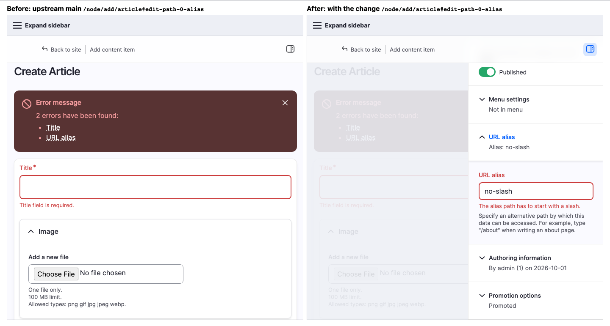

# drupal-core-lab

*What it does in about 15 seconds: two Drupal sites side by side, one set of steps, the difference marked. Low resolution on purpose; the live viewer is full size.*

A workspace for **evaluating Drupal core changes**, kept separate from Drupal core itself. For an issue it can: build upstream core
and a patched copy side by side, let a person reproduce the problem and confirm the fix, replay the steps with real input and
axe-core, compare what each site serves, and keep the evidence so the work can be **repeated later, on the same core or on updated
Drupal**. Runs locally with DDEV. An opt-in path for a DDEV Coder (coder.ddev.com) workspace is in `tools/compare/cloud/README.md` (partly tested; see its status table). Nothing is posted anywhere automatically.

*The side-by-side viewer: upstream Drupal (left) and the same page with a patch (right), showing issue #3619127 (error links that should open the form's sidebar). It repeats your setup in both frames, runs checks, and compares accessibility as you click.*

## Start here
| I want to... | Go to |
|---|---|
| Reproduce #3619127 (the worked example) | [reports/issues/3619127/REPRODUCE.md](reports/issues/3619127/REPRODUCE.md) |
| See every issue evaluated, and how to come back to it | [reports/issues/README.md](reports/issues/README.md) |
| Start a new issue | [docs/NEW-ISSUE.md](docs/NEW-ISSUE.md) |
| **First time here? Fresh clone to first comparison** | [docs/FIRST-RUN.md](docs/FIRST-RUN.md) |
| **Learn to use the viewer to test an issue** (with screenshots) | [docs/USER-GUIDE.md](docs/USER-GUIDE.md) |
| Look up viewer options and the variants.json format | [tools/compare/README.md](tools/compare/README.md) |
| See what has and has not been tested (browsers, colour modes) | `reports/issues/<nid>/COVERAGE.md`, e.g. [3619127](reports/issues/3619127/COVERAGE.md) |
| Run the scripted walkthroughs and the virtual screen reader | [tools/playwright/README.md](tools/playwright/README.md) |
| Know what each tool can and cannot tell me | [docs/TESTING-TOOLS.md](docs/TESTING-TOOLS.md) |
| Work here as an agent (rules, environments, commands) | [AGENTS.md](AGENTS.md), and [AI-LEARNING.md](AI-LEARNING.md) for what earlier sessions learned |
| Give someone a self-contained copy of one reproduction | `node scripts/make-bundle.mjs <slug>`, then `bundles/` |

## Quick start (needs Docker, DDEV 1.24+, git, Node 20+; ~10 GB free disk space; first run 10 to 20 minutes)
    node tools/compare/setup.mjs 3619127-pinned      # builds Before (upstream) and After (with the patches), applies the recipe
    node scripts/lab-env.mjs start 3619127-pinned    # starts both sites and the viewer: https://drupal-compare.ddev.site or http://localhost:8100/
    (or run the viewer alone: node tools/compare/serve.mjs 3619127-pinned)

A read-only copy of the viewer's guide for each issue (no live sites) is the GitHub Pages site, built into `cloud/` by `node scripts/build-cloud.mjs`.

## Layout
    AGENTS.md  MIGRATION.md  ACCESSIBILITY.md  STYLES.md
    docs/                  current docs; docs/legacy/ is inherited from the old fork and describes a workflow that no longer exists
    reports/issues/<nid>/  per issue: REPRODUCE.md, patches, validation, status, generated evidence (kept over time)
    reports/_templates/    EVIDENCE.md, ISSUE-COMMENT-DRAFT.md, REPRODUCE.md
    recipes/               Drupal recipes that create each issue's starting state
    tools/compare/         setup, viewer, diff report, variants.json (+ site/: optional DDEV address for the viewer)
    tools/playwright/      scripted walkthroughs, virtual screen reader, frame-load diagnostic
    cloud/                 GENERATED static site for GitHub Pages (scripts/build-cloud.mjs); do not edit by hand
    scripts/               lab-env, new-issue, make-bundle, index-issues, build-cloud, coverage, lab-site.sh
    bundles/               built zips (a slice of this repository plus a setup command; no Drupal core)
    patches/ tests/ tools/*.js   scanners and collected patches migrated from the old fork (legacy; see MIGRATION.md)
    .agents/ .claude/      AI skills and agent definitions
    envs/                  disposable core worktrees, one DDEV project each (gitignored)

Modelled on [justafish/ddev-drupal-core-dev](https://github.com/justafish/ddev-drupal-core-dev) (a DDEV add-on for core development)
and on the compare tool in FOSDEM-website.

## License
The code, scripts and documentation in this repository are licensed under the **GNU General Public License, version 2 or (at your option) any
later version** (SPDX: `GPL-2.0-or-later`), the same licence as Drupal core. See [LICENSE.txt](LICENSE.txt). Patches in `reports/issues/*/branches/`
are changes to Drupal core and carry core's licence. Third-party tools are installed from npm or DDEV and keep their own licences (Playwright and the
DDEV add-on: Apache-2.0; axe-core: MPL-2.0, not committed). Material inherited from the old fork (`docs/legacy/`, `ACCESSIBILITY.md`, `STYLES.md`,
`.agents/`) keeps whatever licence it had there; check its source before reusing it elsewhere.
