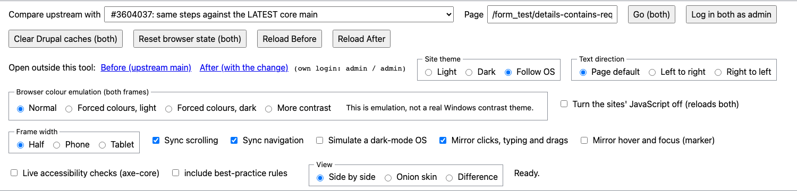

# Testing forced colours (Windows "contrast themes" and similar)

**What it is.** In forced-colors mode the browser replaces the page's colours with a small palette the user chose (for example black on white, or
yellow and blue on black). Author colours for text, backgrounds, borders and outlines are overridden, with these exceptions: a colour written as a
**system colour keyword** (`CanvasText`, `LinkText`, `ButtonText`, `Highlight`...) is kept, and `forced-color-adjust: none` opts an element out. Anything
that relies on colour alone (a red border) can vanish; shapes, icons and text survive. That is why it matters for #3604037, which marks a group that
contains an error with a red bar, a red label and an icon.

## The easiest way: start the viewer in the lab browser
    node scripts/lab-env.mjs start <slug> --browser        (or, with the viewer already running:  node scripts/lab-env.mjs browser)

This opens the viewer straight into the **lab browser**, a Chromium window the lab server controls, so the **Browser colour emulation** switch is on the page and you
need only one window. It opens in Normal; pick a forced mode when you want it. The lab browser has its **own saved profile** (`.lab-browser/`, not committed), so the
viewer's remembered choices, step ticks and notes survive between launches; it does not use your everyday browser's extensions or logins. Start clean with
`node scripts/lab-env.mjs browser --reset`. Test: `node tools/playwright/lab-browser.mjs`.

## From a normal browser tab: the forced-colours window
In the viewer press **Open forced-colours window**. A separate Chromium window opens on the viewer **already in forced colours (light)**, and in it a **Browser colour emulation** switch
lets you move between *Normal*, *Forced colours, light*, *Forced colours, dark* (the black high-contrast palette) and *More contrast*, live, for
**both frames at once**. The line beside the switch shows what each frame actually reports (for example "Before: forced colours on, dark"), so you can see the
setting really reached them. It is **emulation**, not a real Windows contrast theme, so keep a real-theme check (below) for the final word. The window is a clean
Chromium profile (no extensions, no logins): press **Log in both as admin** in it. It needs the lab's Playwright install (`node scripts/doctor.mjs` checks it),
and it exists only when the lab server is running; the read-only GitHub Pages guide does not have it. Test: `node tools/playwright/forced-window.mjs`.

## Other ways to turn it on
| Where | How |
|---|---|
| Real thing (best) | Windows: Settings > Accessibility > Contrast themes. Firefox on any OS: Settings > General > Colors > Manage Colors > "Always" high contrast. |
| Chrome / Edge | DevTools > More tools > Rendering > "Emulate CSS media feature forced-colors" > active. Pair with "prefers-color-scheme" to try the light and dark palettes. |
| Playwright | `browser.newContext({ forcedColors: 'active', colorScheme: 'dark' })` (see `tools/playwright/evaluate-3604037.mjs`). |

## Does it work with the side-by-side viewer's frames?
Yes, when the setting is made on the **whole tab** (DevTools Rendering panel, Playwright's context, or the operating system): the emulation applies to
every frame in the tab. We checked this: with `forcedColors: 'active'` on the viewer page, `matchMedia('(forced-colors: active)')` is true inside both
frames. The viewer page itself cannot turn forced colours on, because a web page is not allowed to change that setting; that is why the button above opens a window the server controls. Otherwise make the setting first, then reload the frames. Both frames follow the same setting, so the comparison is fair. (The viewer's "Colour mode" and "Simulate a dark-mode OS" are different:
they change the site's own dark mode, not forced colours.)

## What to look at
1. Is the thing that was marked still **distinguishable without colour** (an icon, text, a shape)? 
2. Are icons **visible** (not the same colour as the background)? An icon drawn with a CSS `mask-image` takes its colour from `background-color`, and
   forced colours overrides plain colours, so `background: currentColor` alone makes it vanish (we tested this: contrast 1:1).
3. Does the icon's colour **match the text it marks**? Compare it with the label, in both the light and the dark palette.
4. Is the focus indicator still visible, and not hidden behind a border?

## Scripted comparison
    node tools/playwright/evaluate-3604037.mjs 3604037-latest --modes=forced,forced-dark,forced-preserve,forced-dark-preserve

It writes side-by-side images (Before, After, and After with a proposed change) and contrast numbers to `reports/issues/3604037/playwright/`. The proposals
(`*-currentcolor`, `*-preserve`, `*-linktext`) rewrite the CSS in the browser only; nothing in an environment is changed.

## Automated checks do not replace this
axe-core does not evaluate forced-colors rendering. A person (or a screenshot comparison like the one above) has to look.
