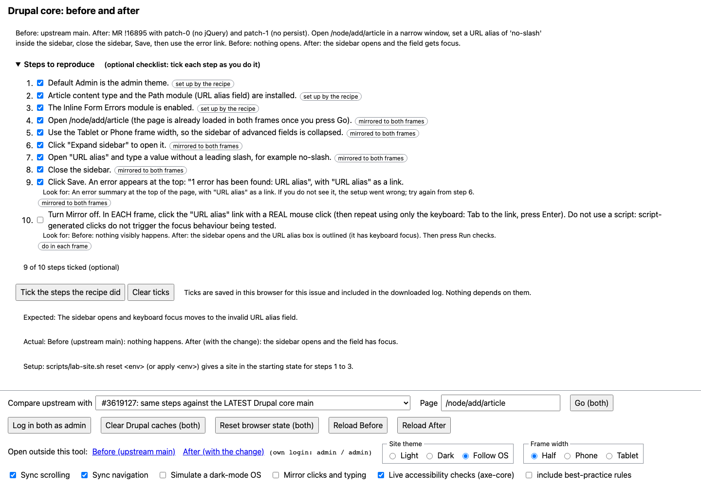
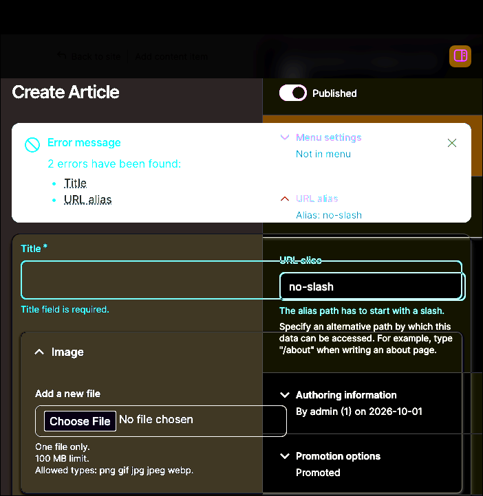
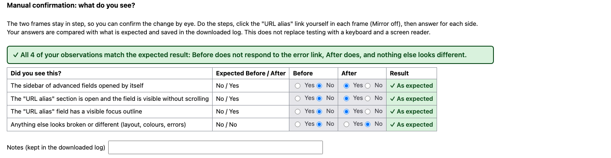
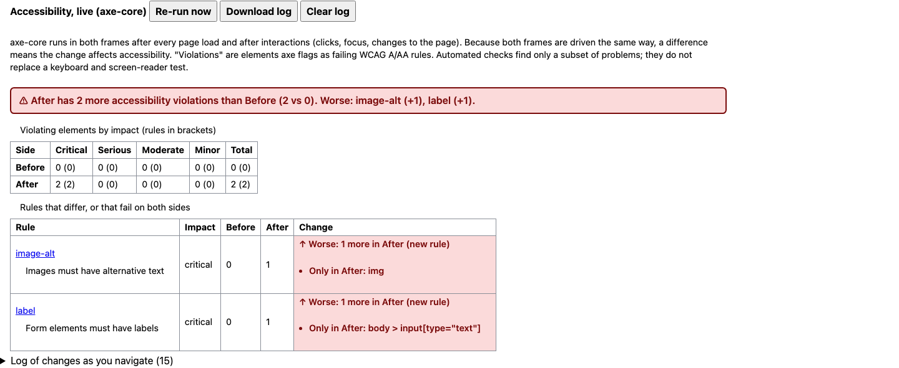
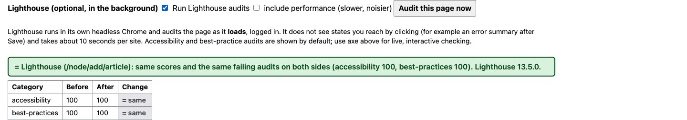
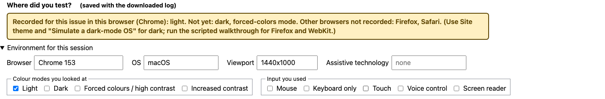

# User guide: testing a Drupal core issue with the side-by-side viewer

This guide is for someone who wants to **see a Drupal core issue work (or not)** and confirm a patch does what it claims, without
being an expert in the lab. It uses issue [#3619127](https://www.drupal.org/project/drupal/issues/3619127) as the example. Local
development only: everything runs on your own computer, and nothing is posted anywhere.

*The point of the tool. Left: upstream Drupal after clicking the error link: nothing happened. Right: with the change, the sidebar opened to the invalid field.*

## 1. What you need
Docker, [DDEV](https://ddev.com/) 1.24 or newer, git and Node.js 20+ (22.19+ for the optional Lighthouse panel). About 10 GB of disk and 8 GB
of memory. The first setup takes 10 to 20 minutes because it downloads Drupal core and installs it twice.

## 2. Build once, then start with one command
    node tools/compare/setup.mjs 3604037-latest      # first time only: builds Before (core) and After (core + the change); safe to re-run
    node scripts/lab-env.mjs start 3604037-latest    # every time: starts both sites AND the viewer
    node scripts/lab-env.mjs stop 3604037-latest     # when you are done (nothing is lost)

The viewer opens at https://drupal-compare.ddev.site (or http://localhost:8100). While the sites are still starting it shows a **"The sites are
still loading"** message and reloads the frames by itself when both answer. Steps the recipe already did start ticked. Long URLs in the
frame headings are shortened to one line; hover or focus a frame to see the whole address. To run only the viewer:
`node tools/compare/serve.mjs <slug> [--ddev]` (`--ddev` after `cd tools/compare/site && ddev start` once). Both sites log in as
`admin` / `admin`. If a command stops with `ddev-router failed to become ready`, run it again: it resumes.

Optional extras (live accessibility checks, Lighthouse, dark-mode simulation) are **off until you turn them on**. Your choices are remembered
in this browser only (`localStorage`); nothing is stored on a server or in an account. The GitHub Pages copy is a read-only guide and runs no checks.

## 3. A tour of the page

**Steps to reproduce (optional checklist).** The numbered steps for this issue. Tick each as you go if it helps you keep track (ticks
are saved in your browser and in the downloaded log; nothing depends on them). Each step is tagged: *set up by the recipe* (already
done for you), *mirrored to both frames* (do it once, the viewer repeats it on the other side), or *do in each frame* (you do it, in each
frame, because that is the thing being tested). "Look for" lines say what you should see. **Expected** and **Actual** say what the issue
claims.

**Controls.** *Log in both as admin*; *Go (both)* opens the same page on both sides; *Clear Drupal caches (both)* and *Reset browser state
(both)* fix most "it should have worked" surprises (the second clears the saved sidebar preference); *Reload Before / After* for a stuck
frame; *Open outside this tool* opens the real Before or After site in its own window. *Site theme*, *Simulate a dark-mode OS* and *Frame
width* change how both sides look so you can check dark mode and narrow screens. *Sync scrolling* and *Sync navigation* keep the frames
in step.

**Forced colours** (Windows contrast themes): start with `node scripts/lab-env.mjs start <slug> --browser` to use the viewer inside a lab browser that has a built-in switch for both frames, or press **Open forced-colours window** from a normal tab (see `docs/FORCED-COLORS.md`).

**Mirror clicks, typing and drags.** Your real clicks, typing, checkboxes, selects and drags (for example reordering rows in a Drupal table) in one frame are repeated in the other, so you do the
setup once. **Mirror hover and focus** (off by default) draws a marker on the matching element in the other frame; it cannot make the real hover or focus style appear there, because browsers do not let a page set those. Rich text in CKEditor is mirrored as content only (not selection or toolbar state; see `tools/compare/README.md`). It does **not** mirror the keyboard (Tab, Enter) or focus, and the repeated click is a script click, which does not behave like
a real one. So turn it off (Run checks does this for you) and do the final step yourself in each frame.

## 4. Do the test
1. Press **Log in both as admin**, then **Go (both)**.
2. Follow the steps. With Mirror on, do the setup steps once in either frame.
3. Turn Mirror **off**. Click the "URL alias" link in the error summary with a **real mouse click in each frame**, and again using only the
   keyboard (Tab to the link, press Enter). The status next to *Run checks* shows which frame has had a real click.
4. Press **Run checks**.

**Reading Run checks.** The rule: a **fix** check should *fail on Before and pass on After*; a **regression** check should *pass on both*;
a **precondition** must pass on both, or nothing else means anything (for example, you have not yet reached the error state, or you used
a script click). Results use a tick or cross **and words**, not colour alone. The banner turns red and tells you which rule was not met.

## 5. See the differences

**View: Difference** overlays the two sites so identical pixels are black and anything that changed lights up (the opened sidebar above).
**Amplify** reveals faint differences. **Onion skin** fades one over the other. Both keep the same frame width as side by side. Focus
rings appear as differences too, because only one frame can hold keyboard focus.

## 6. Confirm it yourself
Because the frames stay in step, you can simply look and answer.

The **Manual confirmation** panel asks yes/no questions for each side, compares them with what is expected, and keeps your answers and notes
in the downloaded log. It does not depend on the automated checks.

## 7. Watch for accessibility regressions as you click around
**Accessibility, live (axe-core)** re-checks both frames after every page load and interaction and tells you when After has **more or
fewer** violations than Before, with the exact elements. A tab-title prefix (⚠) warns you if you are in another tab. Optionally,
**Lighthouse** audits the page as it loads (accessibility and best practices; performance is opt-in). Lighthouse needs
`npm install --prefix tools/compare/.deps lighthouse` and Node 22.19+, and sees fresh page loads only, not states you reach by clicking.

*A demonstration: two defects were added to the After frame on purpose to show the alert. On the real page both sides had 0 violations
in light mode. Dark mode found a real, pre-existing contrast problem; see `reports/issues/3619127/FINDINGS-2026-10-01.md`.*

## 8. Record where you tested (and what you have not)
It is easy to test only in one browser in light mode. The viewer notes the browser and colour mode as you test, and **Where did you test?**
reminds you what is still missing for this issue.

Click **Download log** (in the accessibility panel) and save it in `reports/issues/<nid>/manual/`. Then:

    node scripts/coverage.mjs 3619127      # writes reports/issues/3619127/COVERAGE.md

`COVERAGE.md` shows each browser, colour mode and viewport as tested, or **NOT TESTED**, plus manual checks you have not done. Scripted
runs fill the automated rows: `node tools/playwright/walkthrough.mjs 3619127-pinned --browser=webkit --scheme=dark`.
Browsers: Chromium, Firefox and WebKit (Safari's engine). Colour modes: light, dark, forced colours.

## 9. If something looks wrong
| What you see | What to do |
|---|---|
| A frame stays blank | An alert appears after 12 seconds and checks both sites. Use **Reload Before / After**. See `docs/FRAME-LOADING-2026-10-01.md`. |
| "Setup not reached" | You are not in the error state, or a frame has had no real click. Redo the steps; turn Mirror off; click in each frame yourself. |
| Both sides fail the fix checks | Check you used a real click (not a script), and that the page reloaded after Save. Press **Reset browser state**, redo the steps. |
| Before passes (does not fail) | The problem may already be fixed upstream on this core; see the issue's `REPRODUCE.md`. |
| Odd styling or old behaviour | **Clear Drupal caches (both)**, then reload. |
| A site is not answering | `ddev list`, then `ddev restart` in that environment (`envs/<name>`). |

## 10. Come back later, or try newer Drupal
Everything needed is in the issue's `REPRODUCE.md` (`reports/issues/3619127/REPRODUCE.md`): the pinned core for exact reproduction, a
check of whether the patches still apply to current core, and how to read the result. Starting your own issue: `docs/NEW-ISSUE.md`.

## What this does not tell you
Automated checks find a subset of accessibility problems; the viewer compares behaviour in a browser and is not a replacement for testing
with a keyboard and a screen reader. A synthetic virtual screen reader is the lab's standard; a real one is not part of the routine.
